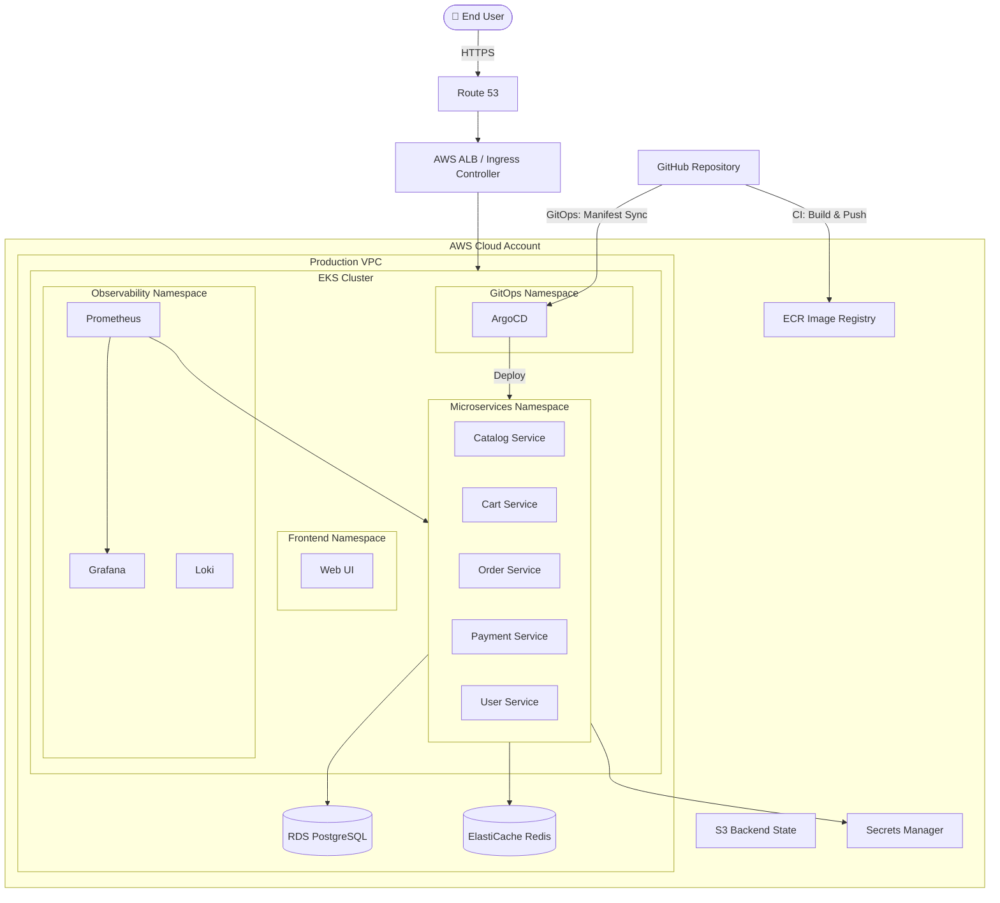

<div align="center">

# 🛒 Real-World E-Commerce DevOps Project on AWS EKS with Terraform

### *Production-Grade End-to-End DevOps Implementation*

[](https://aws.amazon.com/)
[](https://www.terraform.io/)
[](https://kubernetes.io/)
[](https://helm.sh/)
[](https://argo-cd.readthedocs.io/)
[](https://github.com/features/actions)
[](https://prometheus.io/)
[](https://grafana.com/)

[](https://opensource.org/licenses/MIT)
[](http://makeapullequest.com)
[](https://github.com/YOUR_USERNAME/real-world-ecommerce-devops-project-eks-terraform/stargazers)
[](https://github.com/YOUR_USERNAME/real-world-ecommerce-devops-project-eks-terraform/network/members)
[](https://github.com/YOUR_USERNAME/real-world-ecommerce-devops-project-eks-terraform/issues)

---

### 🚀 *Build, deploy, and operate a production-grade microservices e-commerce platform on AWS EKS — the way real engineering teams do it.*

[**📺 Watch the YouTube Series**](#-youtube-series) • [**🏗️ Architecture**](#%EF%B8%8F-architecture) • [**⚡ Quick Start**](#-quick-start) • [**📚 Documentation**](#-documentation) • [**🤝 Contributing**](#-contributing)

</div>

---

## 📖 About The Project

This repository is a **complete, real-world DevOps project** that walks you through provisioning, deploying, and operating a microservices-based **e-commerce application** on **AWS EKS** using **Terraform** as the single source of truth for infrastructure.

It's designed to mirror what actually happens in production engineering teams — not toy examples. Every module, pipeline, and policy in this repo is something you'd find in a real company running Kubernetes at scale.

### 🎯 Who This Is For

- **DevOps engineers** preparing for senior/lead roles or interviews
- **SREs and platform engineers** building EKS reference architectures
- **Cloud engineers** transitioning from generalist AWS work into Kubernetes
- **Developers** who want to understand how their code reaches production
- **Students and career-switchers** building a portfolio project that recruiters take seriously

### ✨ What Makes This Different

- ✅ **Production-grade**, not tutorial-grade — IRSA, network policies, secrets management, autoscaling, observability, and security baked in
- ✅ **Modular Terraform** — reusable modules, clean separation between environments (dev / staging / prod)
- ✅ **GitOps-native** — ArgoCD-driven continuous deployment, no `kubectl apply` in pipelines
- ✅ **End-to-end** — from VPC and IAM all the way to Grafana dashboards and chaos testing
- ✅ **Documented like real engineering** — ADRs, runbooks, and architecture diagrams included

---

## 🏗️ Architecture

<div align="center">



</div>

### 🧩 Tech Stack at a Glance

| Layer | Tools |
|---|---|
| **Cloud Provider** | AWS (EKS, VPC, IAM, ALB, Route 53, RDS, ElastiCache, ECR, S3, Secrets Manager) |
| **Infrastructure as Code** | Terraform (with remote S3 backend + DynamoDB state locking) |
| **Container Orchestration** | Kubernetes (EKS 1.30+) |
| **Application Packaging** | Helm Charts |
| **Continuous Deployment** | ArgoCD (GitOps) |
| **Continuous Integration** | GitHub Actions |
| **Observability** | Prometheus, Grafana, Loki, AWS CloudWatch |
| **Security** | IRSA, Network Policies, Pod Security Standards, External Secrets, Trivy, Checkov |
| **Ingress & TLS** | AWS Load Balancer Controller, ExternalDNS, Cert-Manager |
| **Service Mesh (optional)** | Istio / Linkerd |

---

## 🚀 Quick Start

### ✅ Prerequisites

Make sure you have the following installed and configured:

```bash
aws --version          # AWS CLI v2.13+
terraform --version    # Terraform v1.6+
kubectl version        # kubectl v1.30+
helm version           # Helm v3.13+
git --version          # Git v2.40+
```

You'll also need:

- An **AWS account** with admin (or sufficiently scoped) credentials
- A **registered domain** (optional, for HTTPS via Route 53 + ACM)
- **Estimated cost**: ~$3–6/hour while running the full stack — **destroy when not in use**

### ⚡ One-Command Bootstrap

```bash
# 1. Clone the repository
git clone https://github.com/YOUR_USERNAME/real-world-ecommerce-devops-project-eks-terraform.git
cd real-world-ecommerce-devops-project-eks-terraform

# 2. Configure AWS credentials
aws configure

# 3. Bootstrap remote state backend (S3 + DynamoDB)
cd terraform/bootstrap
terraform init && terraform apply

# 4. Provision the EKS cluster and supporting infra
cd ../environments/dev
terraform init && terraform apply

# 5. Configure kubectl
aws eks update-kubeconfig --name ecommerce-dev --region us-east-1

# 6. Install platform add-ons (ArgoCD, ingress, observability)
make platform-install

# 7. Deploy the e-commerce application via ArgoCD
make app-deploy
```

> 💡 Detailed step-by-step walkthrough lives in [`docs/getting-started.md`](docs/getting-started.md).

---

## 📂 Repository Structure

```
real-world-ecommerce-devops-project-eks-terraform/
│
├── terraform/
│   ├── bootstrap/              # S3 + DynamoDB remote state backend
│   ├── modules/                # Reusable Terraform modules
│   │   ├── vpc/
│   │   ├── eks/
│   │   ├── rds/
│   │   ├── elasticache/
│   │   ├── irsa/
│   │   └── addons/
│   └── environments/
│       ├── dev/
│       ├── staging/
│       └── prod/
│
├── kubernetes/
│   ├── platform/               # ArgoCD, ingress, cert-manager, external-dns
│   ├── observability/          # Prometheus, Grafana, Loki
│   └── policies/               # Network policies, PSS, OPA Gatekeeper
│
├── helm-charts/
│   ├── frontend/
│   ├── catalog-service/
│   ├── cart-service/
│   ├── order-service/
│   ├── payment-service/
│   └── user-service/
│
├── argocd/
│   └── applications/           # ArgoCD Application & ApplicationSet manifests
│
├── .github/
│   └── workflows/              # CI/CD pipelines (build, test, scan, deploy)
│
├── docs/
│   ├── architecture.md
│   ├── getting-started.md
│   ├── runbooks/
│   └── adr/                    # Architecture Decision Records
│
├── scripts/                    # Helper scripts (bootstrap, teardown, etc.)
├── Makefile
└── README.md
```

---

## 🎬 What You'll Build, Step by Step

| # | Stage | What You Learn |
|---|---|---|
| 1 | **Foundation** | AWS account hardening, remote state, IAM strategy |
| 2 | **Networking** | Production VPC — public/private subnets, NAT, route tables, VPC endpoints |
| 3 | **EKS Cluster** | Multi-AZ EKS, managed node groups, OIDC provider, cluster logging |
| 4 | **IAM for Pods** | IRSA — IAM Roles for Service Accounts, the right way |
| 5 | **Ingress & TLS** | AWS Load Balancer Controller, ExternalDNS, Cert-Manager, ACM |
| 6 | **Data Layer** | RDS PostgreSQL with Multi-AZ, ElastiCache Redis, automated backups |
| 7 | **Secrets** | AWS Secrets Manager + External Secrets Operator |
| 8 | **GitOps** | ArgoCD installation, App-of-Apps pattern, sync waves |
| 9 | **CI Pipelines** | GitHub Actions — build, test, scan (Trivy), push to ECR |
| 10 | **CD Pipelines** | Image updater, manifest bumps, progressive delivery |
| 11 | **Observability** | Prometheus, Grafana dashboards, Loki logs, alerting |
| 12 | **Security** | Network policies, Pod Security Standards, OPA Gatekeeper, image signing |
| 13 | **Scaling** | HPA, VPA, Cluster Autoscaler / Karpenter |
| 14 | **Reliability** | PDBs, readiness/liveness probes, graceful shutdown, chaos testing |
| 15 | **Cost & Cleanup** | Cost dashboards, resource tagging, automated teardown |

---

## 📺 YouTube Series

🎥 Each part of this project ships with a deep-dive video walkthrough.

📌 **Playlist:** *Real-World E-Commerce DevOps Project on AWS EKS with Terraform*

> Subscribe and turn on notifications — new episodes drop every week.
> Link your channel/playlist here once published.

---

## 🛡️ Security Highlights

This isn't a "demo cluster" — security is treated as a first-class concern:

- 🔐 **IRSA** for fine-grained pod-level AWS permissions (no node-level wildcards)
- 🔐 **External Secrets Operator** — secrets flow from AWS Secrets Manager, never committed to Git
- 🔐 **Network Policies** — default-deny posture, explicit allow lists
- 🔐 **Pod Security Standards** — `restricted` profile enforced on workload namespaces
- 🔐 **Image scanning** — Trivy in CI, blocks high/critical CVEs
- 🔐 **IaC scanning** — Checkov / tfsec on every PR
- 🔐 **Encrypted everything** — EBS, RDS, S3, Secrets Manager, in-transit TLS

---

## 💰 Cost Awareness

Running this full stack 24/7 in `us-east-1` costs roughly **$80–150/month** depending on node size and traffic. To keep costs low while learning:

- Use **Spot instances** for non-prod node groups (configurable in `terraform.tfvars`)
- **Destroy environments** with `make destroy-dev` when not actively learning
- Start with **single-AZ** configurations in dev (Multi-AZ is enabled in prod by default)
- Monitor spend with the included **Grafana cost dashboard**

---

## 📚 Documentation

| Doc | What's Inside |
|---|---|
| [Getting Started](docs/getting-started.md) | Step-by-step bootstrap and first deploy |
| [Architecture](docs/architecture.md) | Deep dive into design decisions and diagrams |
| [Runbooks](docs/runbooks/) | Incident response, common ops tasks, troubleshooting |
| [ADRs](docs/adr/) | Architecture Decision Records — *why* we chose what we chose |
| [Contributing](CONTRIBUTING.md) | How to propose changes, coding standards, PR template |

---

## 🗺️ Roadmap

- [x] Phase 1 — Terraform foundation (VPC, EKS, IAM, RDS)
- [x] Phase 2 — Platform add-ons (ArgoCD, ingress, observability)
- [x] Phase 3 — E-commerce microservices deployment
- [ ] Phase 4 — Service mesh (Istio) integration
- [ ] Phase 5 — Multi-region disaster recovery
- [ ] Phase 6 — Progressive delivery with Argo Rollouts
- [ ] Phase 7 — FinOps — cost allocation, rightsizing automation
- [ ] Phase 8 — Chaos engineering with LitmusChaos

See [open issues](https://github.com/YOUR_USERNAME/real-world-ecommerce-devops-project-eks-terraform/issues) for the live list of in-progress work.

---

## 🤝 Contributing

Contributions, issues, and feature requests are welcome — this repo grows stronger with community input.

1. ⭐ Star the repo (it really helps!)
2. 🍴 Fork the project
3. 🔧 Create your feature branch (`git checkout -b feat/amazing-improvement`)
4. ✅ Commit your changes (`git commit -m 'feat: add amazing improvement'`)
5. 🚀 Push to the branch (`git push origin feat/amazing-improvement`)
6. 🎉 Open a Pull Request

Read [`CONTRIBUTING.md`](CONTRIBUTING.md) before submitting.

---

## ⭐ Show Your Support

If this project helped you learn or land a job:

- ⭐ **Star this repository** — it's free and helps others discover it
- 🐦 **Share it** on Twitter / LinkedIn
- 📺 **Subscribe** to the YouTube channel for new episodes
- 💬 **Open an issue** with feedback or feature requests

---

## 📜 License

Distributed under the **MIT License**. See [`LICENSE`](LICENSE) for full text.

You're free to use this for personal learning, internal training, or as a foundation for your own production systems.

---

## 🙏 Acknowledgments

Inspired by the open-source DevOps community and the engineers who share their craft openly.

Special thanks to the maintainers of: Terraform • AWS EKS • Kubernetes • Helm • ArgoCD • Prometheus • Grafana.

---

<div align="center">

### 🚀 *Built with ❤️ for engineers who want to learn the real way.*

**[⬆ Back to Top](#-real-world-e-commerce-devops-project-on-aws-eks-with-terraform)**

</div>
