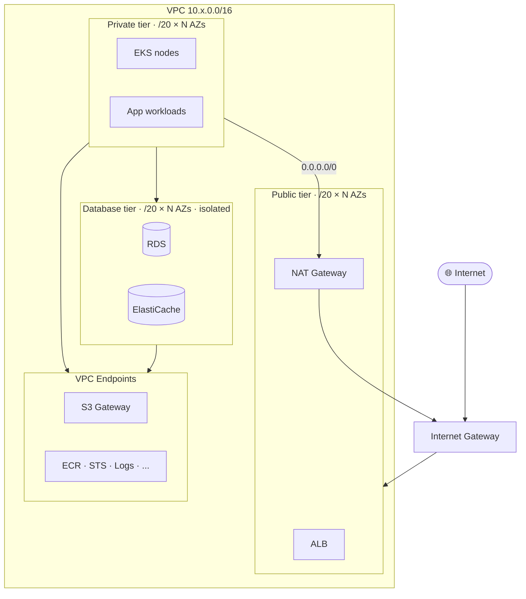

# Network Module — 3-Tier VPC for EKS

A focused, opinionated VPC module designed for production EKS workloads. Provides a hardened 3-tier topology (public, private, database), defense-in-depth NACLs, VPC endpoints to reduce NAT cost, and flexible flow log destinations.

## Design philosophy

This module is **deliberately small and opinionated**. It encodes the design decisions a real production VPC needs — auto-CIDR math, isolated database tier, per-AZ NAT for HA, dedicated NACLs, VPC endpoints — and exposes ~20 variables to configure them.

Compared to a generic library module (such as `terraform-aws-modules/vpc/aws` or our org's `custome-vpc-module/VPC`, which expose 100+ inputs), this module trades flexibility for readability. A reviewer can read the entire module in 15 minutes and understand every decision.

**Build vs buy note.** A larger, more flexible community/org module is the right choice when many teams need many shapes of VPC. A focused module like this is the right choice when one team owns one platform and wants the design intent visible at the call site.

## Architecture



Three semantically distinct tiers, NAT for outbound from private, no NAT route at all from the database tier.

## Tier semantics

| Tier | Internet route | Purpose | EKS subnet tag |
|---|---|---|---|
| **Public** | `0.0.0.0/0 → IGW` | ALB, NAT, bastion | `kubernetes.io/role/elb = 1` |
| **Private** | `0.0.0.0/0 → NAT` (or none) | EKS nodes, app workloads | `kubernetes.io/role/internal-elb = 1` |
| **Database** | *none* | RDS, ElastiCache | none |

The database tier deliberately has no default route. Anything outside the VPC requires either VPC endpoints or VPC peering, added intentionally — never by accident.

## CIDR layout

Subnets are auto-carved with `cidrsubnet(/16, 4, …)` — caller passes only a `/16` and AZs.

| Tier | Slot range | Example (`10.10.0.0/16`) |
|---|---|---|
| Public | `0..3` | `10.10.0.0/20`, `10.10.16.0/20`, `10.10.32.0/20` |
| Private | `4..7` | `10.10.64.0/20`, `10.10.80.0/20`, `10.10.96.0/20` |
| Database | `8..11` | `10.10.128.0/20`, `10.10.144.0/20`, `10.10.160.0/20` |

Up to 4 AZs supported per tier without changing the math.

## File layout

| File | Purpose |
|---|---|
| `main.tf` | VPC, subnets, IGW, NAT, route tables, subnet groups |
| `nacls.tf` | Per-tier dedicated NACLs (defense in depth) |
| `endpoints.tf` | S3 gateway endpoint + interface endpoints |
| `flow-logs.tf` | Flow logs (CloudWatch or S3) |
| `variables.tf` | Inputs |
| `outputs.tf` | Outputs |
| `versions.tf` | Provider/Terraform version constraints |

## Key design decisions

### NAT mode is explicit, not env-coupled

A common antipattern is `nat_count = var.environment == "dev" ? 1 : N`. That couples a module to caller naming conventions. This module exposes two booleans:

| `single_nat_gateway` | `one_nat_gateway_per_az` | Result |
|---|---|---|
| `true` | (any) | Single shared NAT — cheapest, dev-grade |
| `false` | `true` | One NAT per AZ — HA, production |
| `false` | `false` | No NAT — pure VPC-endpoint architecture |

### Per-tier NACLs (defense in depth)

Security groups are stateful and live at the ENI; NACLs are stateless and live at the subnet boundary. We use **both** because:

- A misconfigured SG (accidental `0.0.0.0/0`) is contained by the NACL.
- The DB tier NACL only allows DB ports (5432, 3306, 6379) and only from VPC CIDR — even if a private workload is compromised, lateral movement is contained.
- During an incident, NACLs let us deny entire CIDR ranges instantly without touching workload SGs.

Default rule sets are sensible; pass your own via `*_inbound_acl_rules` / `*_outbound_acl_rules` if needed.

### VPC endpoints

EKS workloads constantly call AWS APIs (ECR, STS, Logs, Secrets Manager). Without endpoints, every call traverses NAT and pays NAT data-transfer charges. With endpoints, traffic stays on the AWS backbone.

| Endpoint type | Cost | Default |
|---|---|---|
| S3 gateway | Free | On |
| DynamoDB gateway | Free | Off |
| Interface endpoints | ~$0.01/hr/AZ + $0.01/GB | On for ECR, EKS, STS, Logs, Secrets, SSM, ELB |

The S3 gateway endpoint alone often pays for itself within a week — ECR image layers are stored in S3, so image pulls go through it.

### Flow logs: CloudWatch or S3

| Destination | When to use |
|---|---|
| CloudWatch Logs | Ad-hoc investigation via Logs Insights. Pricier (~$0.50/GB ingested). |
| S3 | Long retention, Athena analytics, ~25× cheaper. Recommended for production. |

The S3 destination provisions a hardened bucket: versioning, encryption, public-access blocked, TLS-only policy, lifecycle to Glacier IR after 90 days.

## Inputs (selected)

Full list in `variables.tf`. The most important toggles:

| Name | Type | Default | Description |
|---|---|---|---|
| `vpc_cidr` | `string` | — | Must be `/16` |
| `availability_zones` | `list(string)` | — | 2–4 AZs |
| `single_nat_gateway` | `bool` | `false` | One shared NAT (dev) |
| `one_nat_gateway_per_az` | `bool` | `true` | Per-AZ NAT (prod) |
| `enable_flow_logs` | `bool` | `true` | |
| `flow_logs_destination` | `string` | `cloud-watch-logs` | or `s3` |
| `enable_dedicated_nacls` | `bool` | `true` | |
| `enable_vpc_endpoints` | `bool` | `true` | |
| `interface_endpoint_services` | `list(string)` | EKS-friendly list | |

## Outputs (selected)

| Name | Description |
|---|---|
| `vpc_id`, `vpc_cidr` | VPC identifiers |
| `public_subnet_ids`, `private_subnet_ids`, `database_subnet_ids` | Subnet IDs per tier |
| `db_subnet_group_name`, `elasticache_subnet_group_name` | Subnet groups for downstream modules |
| `nat_gateway_mode` | Resolved NAT mode for asserts (`none` / `single` / `per-az`) |
| `interface_endpoint_ids` | Map of service name → endpoint ID |

## Cost shape

| Resource | Dev defaults | Prod defaults |
|---|---|---|
| NAT Gateways | 1 (~$32/mo) | N (one per AZ, ~$32/mo each) |
| VPC interface endpoints | 10 services × 3 AZs × ~$7.30/mo ≈ $220/mo | same |
| Flow logs | CloudWatch, 30-day retention | S3, 90-day → Glacier IR |
| Net dev cost | ~$250/mo for the network layer | ~$300/mo + traffic |

Disabling `enable_vpc_endpoints` saves ~$220/mo but exposes you to NAT data-transfer charges that often exceed that figure for any cluster doing real work.

## Example

```hcl
module "network" {
  source = "../../modules/network"

  project_name       = "ecommerce-eks"
  environment        = "dev"
  vpc_cidr           = "10.10.0.0/16"
  availability_zones = ["ap-south-1a", "ap-south-1b", "ap-south-1c"]

  # Cost-tuned for dev
  single_nat_gateway     = true
  one_nat_gateway_per_az = false

  # Hardening
  enable_flow_logs       = true
  flow_logs_destination  = "cloud-watch-logs"
  enable_dedicated_nacls = true
  enable_vpc_endpoints   = true

  tags = local.common_tags
}

# Pass outputs into downstream modules
module "rds" {
  source              = "../../modules/rds"
  db_subnet_group     = module.network.db_subnet_group_name
  vpc_id              = module.network.vpc_id
  allowed_app_cidrs   = module.network.private_subnet_cidrs
}
```

## Trade-offs and what's intentionally out of scope

This module does not provide:
- IPv6 / dual-stack subnets
- IPAM-managed CIDRs
- Customer Gateway / VPN attachment
- Outpost subnets
- Redshift subnet groups
- Per-AZ tag overrides

If you need any of those, you've outgrown this module — switch to the org's `custome-vpc-module/VPC` (which exposes 233 inputs and supports all of the above). For a single EKS platform, the simpler API here is the right choice.
